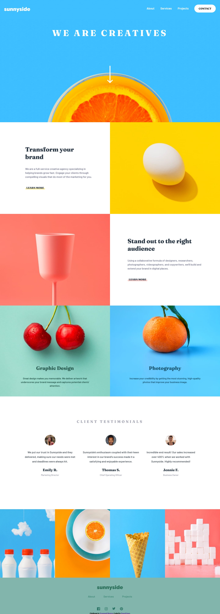

# Frontend Mentor - Sunnyside agency landing page solution

This is a solution to the [Sunnyside agency landing page challenge on Frontend Mentor](https://www.frontendmentor.io/challenges/sunnyside-agency-landing-page-7yVs3B6ef). Frontend Mentor challenges help you improve your coding skills by building realistic projects.

## Table of contents

- [Overview](#overview)
  - [Screenshot](#screenshot)
  - [Links](#links)
- [My process](#my-process)
  - [Built with](#built-with)
  - [What I learned](#what-i-learned)
- [Author](#author)

## Overview

### Screenshot

### Links

- Live Site URL: [Sunnyside Agency landing page](https://pawel-gnat.github.io/Frontend-Mentor-Sunnyside-Agency/)

## My process

Below is my thinking process of Java Script code:

I created consts to toggle menu and active classes on hamburger menu button click event.

### Built with

- Semantic HTML5 markup
- CSS custom properties
- Flexbox
- Grid
- Mobile-first workflow
- JavaScript

### What I learned

I did this challenge in 18 hours. I learned the difference between image and background-image. I learned about :not() property in CSS. I learned how to animate my hamburger button with JavaScript and how to change navigation bar from mobile to desktop view. It might be better done, but I think I should move further to next challenges.

I used BEM methodoloy and SCSS.

## Author

- Frontend Mentor - [@Pawel-Gnat](https://www.frontendmentor.io/profile/Pawel-Gnat)
